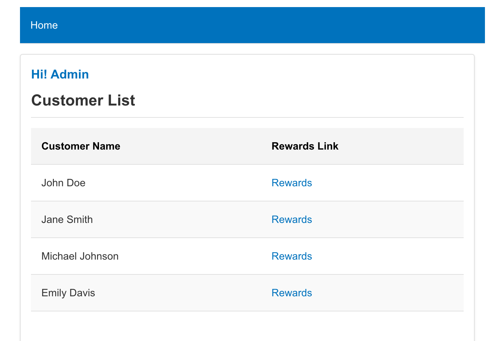
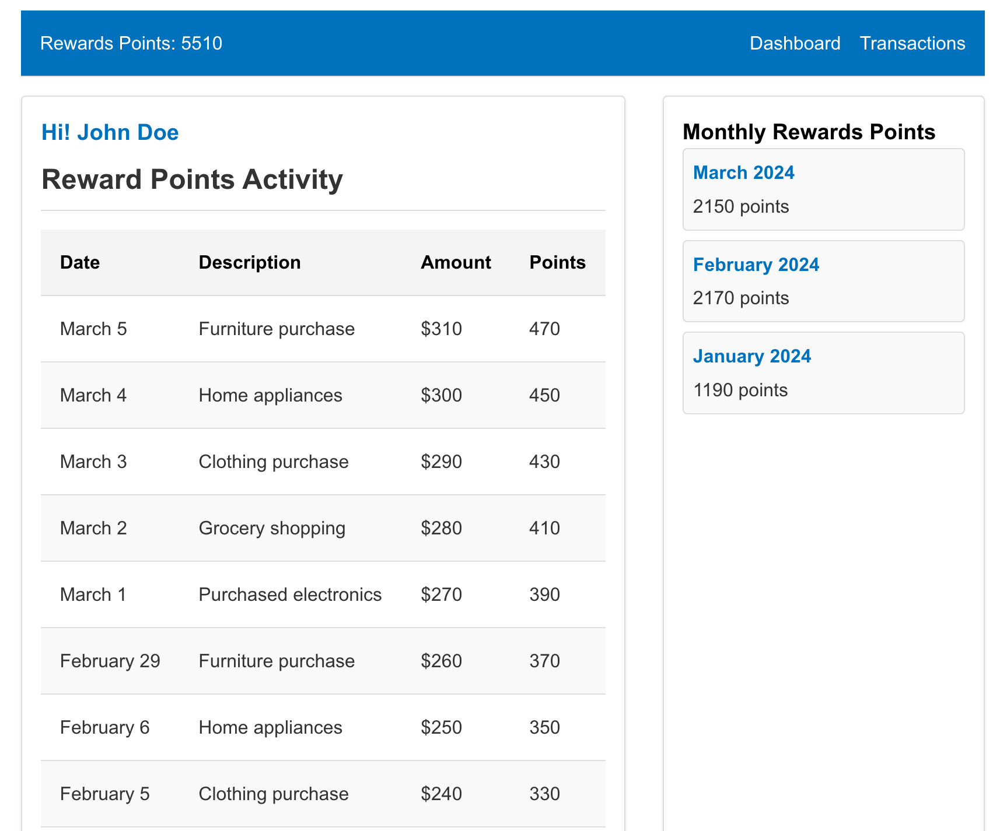
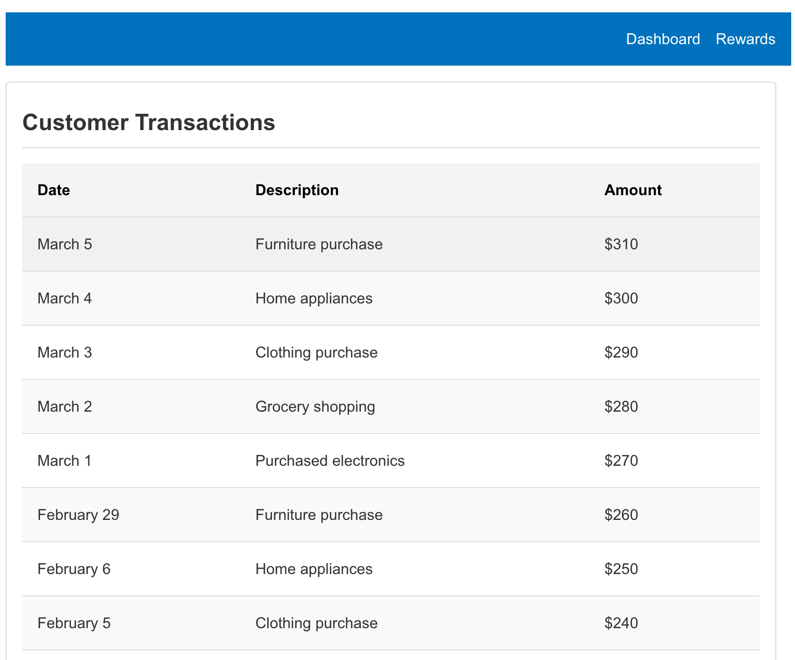

# Rewards Calculator

This is a React front-end application that calculates rewards for customers based on their transactions. The application simulates async API calls to fetch customer and transaction data.

## Table of Contents

- [Screenshots](#Screenshots)
- [Project Setup](#project-setup)
- [Available Scripts](#available-scripts)
- [Simulated API](#simulated-api)
- [Components](#components)
- [Unit Tests](#unit-tests)

## Screenshots

Here are some screenshots of the application:

1. **Customer List:**
   

2. **Rewards Page:**
   

3. **Transactions Page:**
   

## Project Setup

1. **Clone the repository:**
   ```sh
   git clone https://github.com/emilyy-engineer/rewards-calculator.git
   cd rewards-calculator
   ```
2. **Install dependencies:**

   ```sh
   npm install
   ```

3. **Start the development server:**
   ```sh
   npm start
   ```

The application will run in development mode. Open [http://localhost:3000](http://localhost:3000) to view it in the browser.

## Available Scripts

In the project directory, you can run:

### `npm start`

Runs the app in the development mode.\
Open [http://localhost:3000](http://localhost:3000) to view it in your browser.

### `npm run build`

Builds the app for production to the `build` folder.\
It correctly bundles React in production mode and optimizes the build for the best performance.

## Simulated API

The simulated API calls are located in the `src/api/fetchData.js` file. These functions mimic async API requests to fetch customer and transaction data.

## Components

- **common**: Contains common components used across the application, such as `Navbar`, `PageLayout`, and `Greeting`.
- **customers**: Contains components related to customer features, such as `CustomersPage`, `CustomersTable`, and `CustomerRewards`.
- **links**: Contains link components for navigation, such as `DashboardLink`, `RewardsLink`, and `TransactionsLink`.
- **transactions**: Contains components related to transactions, such as `TransactionsTable` and `CustomerTransactions`.

## Unit Tests

Unit tests are included for key components and hooks. These tests are located beside the corresponding component or hook file.

### Running Tests

To run the tests, use the following command:

```sh
npm test
```
